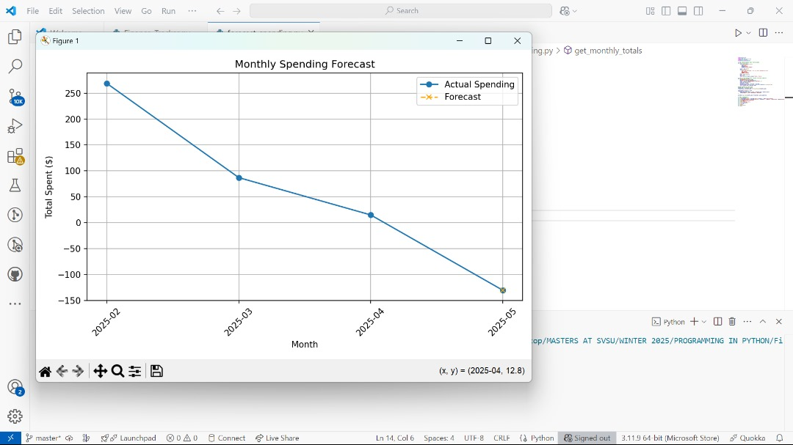

💰 Personal Finance Tracker

A sleek, user-friendly desktop application built with Python and Tkinter that helps users track daily expenses, set monthly budgets, visualize spending habits, and export data to CSV — all stored in a local MySQL database.

---

📌 Project Description

The **Personal Finance Tracker** is a Python-based application that empowers individuals to manage their finances effectively. It supports input of daily expenses, categorization of spending, real-time pie chart visualization, and a monthly budget check system. It also features export functionality for offline analysis.

---

🎯 Purpose & Value

- 🧾 Track your daily and monthly expenses  
- 📊 View colorful pie charts to analyze where your money goes  
- 🧠 Stay within your budget using the budget check feature  
- 📤 Export all expense data into a clean CSV file  
- 🤖 Get a spending forecast using a built-in AI prediction model  
- 💡 Simplified interface built with usability and accessibility in mind
---

🛠️ Technologies Used

- **Python 3.11+**
- **Tkinter** – Graphical User Interface (GUI)
- **MySQL** – Data storage backend
- **Matplotlib** – Data visualization (pie chart)
- **Pandas** – CSV export handling
- **Pillow** – Optional: background image support (if used)

---

⚙️ Setup Instructions

 ✅ 1. Clone the Repository

```bash
git clone https://github.com/Edward-Owusu/Personal-Finance-Tracker.git
cd Personal-Finance-Tracker

✅ 2. Install Dependencies
Make sure Python 3.11+ is installed. Then install the required packages:
pip install -r requirements.txt

✅ 3. Set Up MySQL Database
Open MySQL Workbench or any MySQL GUI and run:
CREATE DATABASE finance_tracker;
🛠️ The expenses table is automatically created when you run the app.

▶️ How to Run
Option A: Run from Python Source Code
python Finance_Tracker.py

Option B: Run the Executable (.exe)
Navigate to the dist/ folder and double-click Finance_Tracker.exe.
No Python installation needed when using the .exe

AI Feature: Spending Forecast

This project includes a basic AI/data insight feature that forecasts your next month's spending using linear regression. It analyzes past monthly expenses and generates a predicted total for the upcoming month.

🧠 How It Works:
- Uses `pandas`, `numpy`, and `matplotlib`.
- Fetches monthly totals from the MySQL database.
- Applies linear regression to project future spending.
- Visualizes actual and predicted spending in a line chart.

▶️ How to Run It
python forecast_spending.py


📊 Forecast Chart:



🎥 YouTube Video Demo
Watch the full walkthrough and demo of the Personal Finance Tracker application:

🔗 Click to Watch on YouTube
https://www.youtube.com/watch?si=WVXO9UUyJiUfLPBb&v=rq9AvFnvuiE&feature=youtu.be

